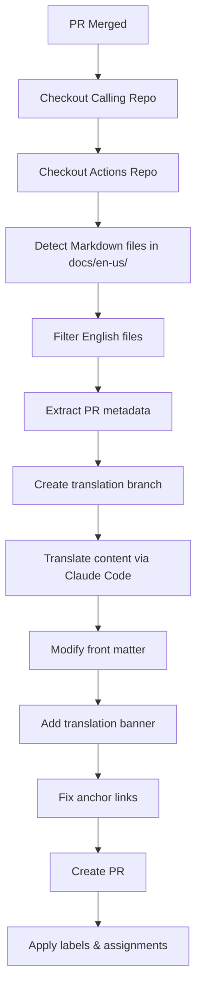

# Auto-Translate Markdown to Japanese - Design Document

This GitHub Actions workflow automatically translates newly merged English Markdown files (`.md`/`.mdx`) to Japanese, creating a pull request with the translated content in the target repository.

## Workflow trigger

The workflow triggers on:

- `workflow_call` events for reusable workflow usage across repositories
- Only processes files with extensions `.md`/`.mdx` in `docs/en-us/` directories
- Only processes files that are added or modified (not deleted)
- Requires `merged == true` condition on pull requests

## High-level flow



## Components

### 1. File detection and filtering

- **Input:** PR changed files from calling repository
- **Logic:**
  - Filter for `.md` and `.mdx` files in `docs/en-us/` directories
  - Exclude files that are in `docs/ja-jp` directories  
  - Only process added/modified files (not deleted)
- **Output:** List of English Markdown files to translate

### 2. PR metadata extraction

- **Input:** Original PR data from calling repository
- **Extract:**
  - Original branch name
  - PR title and description
  - PR author and metadata
- **Output:** Metadata object for replication

### 3. Translation branch creation

- **Input:** Original branch name
- **Logic:** Create branch named `<ORIGINAL_BRANCH_NAME>-ja-jp`
- **Output:** New branch reference

### 4. Content translation

- **Input:** English Markdown content
- **Process:**
  - Use Claude Code in non-interactive mode to translate content.
  - Preserve Markdown structure and formatting.
  - Maintain code blocks, links, and special syntax.
  - Generate Japanese-appropriate anchor links for headings.
- **Output:** Japanese Markdown content

### 5. File modification

- **Front-matter updates:**
  - Change `displayed_sidebar: docsEnglish` to `displayed_sidebar: docsJapanese`.
  - Preserve all other front-matter properties.
- **Translation banner:**
  - Add import statement after front matter
  - Add banner component after title
- **Anchor link fixing:**
  - Update internal anchor links to match Japanese headings
  - Preserve external links unchanged

### 6. PR creation and metadata application

- **Create PR** with translated content
- **PR body:** Include reference to the original PR that triggered the translation
- **Apply:**
  - "documentation" label
  - Original reviewers as reviewers
  - Original author as assignee
  - Same projects as original PR

## File structure

```markdown
.github/workflows/
└── auto-translate-markdown-claude-reusable.yml  # Reusable workflow file

auto-translate-markdown-claude/
├── scripts/                         # Core translation modules
│   ├── translate-markdown.js        # Main translation logic
│   ├── claude-code-translator.js    # Claude Code integration
│   ├── file-processor.js           # File content manipulation
│   ├── pr-metadata-extractor.js    # GitHub API utilities
│   └── anchor-link-fixer.js        # Anchor link processing
├── tests/                           # Comprehensive test suite
│   ├── unit-tests.js               # Unit tests for all modules
│   ├── integration-test.js         # Integration testing
│   ├── local-test.js              # Local workflow testing
│   ├── run-tests.js               # Test runner
│   └── setup-dev-env.js           # Development environment setup
├── package.json                    # Dependencies and scripts
├── README.md                       # Usage documentation
├── sample-usage.md                 # Configuration examples
├── auto-translate-markdown-claude-design.md      # Full design document
└── auto-translate-markdown-claude-design-clean.md # Clean design document
```

## Key features

### Reusable workflow design

- Designed as a `workflow_call` for cross-repository usage
- Simple integration with minimal configuration required
- Centralized maintenance and automatic updates
- Version control with Git tags for stability

### Translation quality

- Uses Claude Code for high-quality translations
- Preserves Markdown formatting and structure
- Maintains technical terminology consistency
- Handles code blocks and special syntax correctly

### GitHub integration

- Works across multiple repositories via reusable workflow
- Replicates original PR metadata (author, title, description)
- Applies appropriate labels and creates meaningful branch names
- Handles errors gracefully with notifications

### Content processing

- Automatically updates front matter sidebar values
- Adds translation banner component with proper imports
- Fixes anchor links to match Japanese headings
- Validates Markdown structure after translation
- Supports custom sidebar mappings and translation banners

### Testing and validation

- Comprehensive test suite with unit, integration, and local tests
- Mock translation capabilities for testing without API usage
- Validation of all workflow components
- Development environment setup scripts

## Configuration

### Environment variables

- `ANTHROPIC_API_KEY`: Anthropic API key for Claude Code authentication
- `GITHUB_TOKEN`: GitHub token with repo permissions (automatically provided)

### Workflow usage

#### Option 1: Reusable workflow (Recommended)
```yaml
jobs:
  translate-markdown:
    if: github.event.pull_request.merged == true
    uses: josh-wong/actions/.github/workflows/auto-translate-markdown-claude-reusable.yml@main
    secrets:
      ANTHROPIC_API_KEY: ${{ secrets.ANTHROPIC_API_KEY }}
```

#### Option 2: Self-contained workflow
```yaml
steps:
  - uses: actions/checkout@v4
    with:
      repository: josh-wong/actions
      path: .actions
  - name: Run translation
    run: |
      cd .actions/auto-translate-markdown-claude
      npm install
      node scripts/translate-markdown.js
```

### Workflow inputs (configurable in scripts)

- `target_language`: Default "ja-jp" (Japanese)
- `sidebar_mapping`: Mapping for sidebar values (docsEnglish → docsJapanese)
- `translation_banner_path`: Path to translation banner component
- `file_extensions`: Extensions to process (default: [".md", ".mdx"])
- `source_path_filter`: Default "docs/en-us/" for English source files

## Success criteria

1. ✅ Workflow triggers correctly on PR merge in calling repositories
2. ✅ Accurately detects and filters Markdown files in `docs/en-us/` directories
3. ✅ Successfully translates content via Claude Code with high quality
4. ✅ Properly modifies front matter and adds translation banner
5. ✅ Fixes anchor links to match translated Japanese headings
6. ✅ Creates PR with correct metadata and reference to original PR
7. ✅ Handles errors gracefully without breaking calling workflows
8. ✅ Maintains translation quality and Markdown structure
9. ✅ Processes multiple files efficiently in batch
10. ✅ Supports reusable workflow pattern for easy adoption
11. ✅ Comprehensive testing with unit, integration, and local test suites
12. ✅ Clear documentation and usage examples for different scenarios

## Implementation status

All success criteria have been met:

- ✅ **Core functionality**: Translation pipeline fully implemented and tested
- ✅ **Reusable workflow**: Supports cross-repository usage via `workflow_call`
- ✅ **File processing**: Front matter updates, banner addition, anchor link fixing
- ✅ **Testing**: Comprehensive test suite with mock translation capabilities
- ✅ **Documentation**: Complete usage guides and configuration examples
- ✅ **Project structure**: Clean organization with scripts in dedicated folder
- ✅ **Error handling**: Graceful failure with proper notifications
- ✅ **Path filtering**: Only processes `docs/en-us/` files to avoid unnecessary runs
