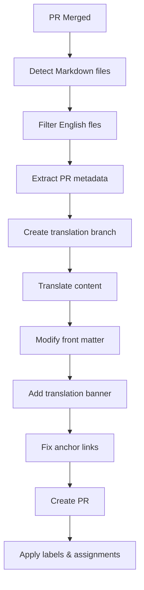

# Auto-Translate Markdown to Japanese - Design Document

This GitHub Actions workflow automatically translates newly merged English Markdown files (`.md`/`.mdx`) to Japanese, creating a pull request with the translated content in the target repository.

## Workflow trigger

The workflow triggers on:

- `pull_request` events with `closed` type where `merged == true`.
- Only processes files with extensions `.md`/`.mdx`.
- Only processes files that are added or modified (not deleted).

## High-level flow



## Components

### 1. File detection and filtering

- **Input:** PR changed files
- **Logic:**
  - Filter for `.md` and `.mdx` files
  - Exclude files that are in `docs/ja-jp` directories
  - Only process added/modified files (not deleted)
- **Output:** List of English Markdown files to translate

### 2. PR metadata extraction

- **Input:** Original PR data
- **Extract:**
  - Original branch name
  - PR author
  - Reviewers list
  - Applied labels
  - Associated projects
  - PR title and description
- **Output:** Metadata object for replication

### 3. Translation branch creation

- **Input:** Original branch name
- **Logic:** Create branch named `<ORIGINAL_BRANCH_NAME>-ja-jp`
- **Output:** New branch reference

### 4. Content translation

- **Input:** English Markdown content
- **Process:**
  - Use Claude Code in non-interactive mode to translate content.
  - Preserve Markdown structure and formatting.
  - Maintain code blocks, links, and special syntax.
  - Generate Japanese-appropriate anchor links for headings.
- **Output:** Japanese Markdown content

### 5. File modification

- **Front-matter updates:**
  - Change `displayed_sidebar: docsEnglish` to `displayed_sidebar: docsJapanese`.
  - Preserve all other front-matter properties.
- **Translation banner:**
  - Add import statement after front matter
  - Add banner component after title
- **Anchor link fixing:**
  - Update internal anchor links to match Japanese headings
  - Preserve external links unchanged

### 6. PR creation and metadata application

- **Create PR** with translated content
- **PR body:** Include reference to the original PR that triggered the translation
- **Apply:**
  - "documentation" label
  - Original reviewers as reviewers
  - Original author as assignee
  - Same projects as original PR

## File structure

```markdown
.github/workflows/
└── auto-translate-markdown.yml     # Main workflow file

auto-translate-markdown/
├── translate-markdown.js           # Main translation logic
├── claude-code-translator.js       # Claude Code integration
├── file-processor.js              # File content manipulation
├── pr-metadata-extractor.js       # GitHub API utilities
└── anchor-link-fixer.js           # Anchor link processing

package.json                        # Dependencies
README.md                          # Usage documentation
```

## Key features

### Translation quality

- Uses Claude Code for high-quality translations
- Preserves Markdown formatting and structure
- Maintains technical terminology consistency
- Handles code blocks and special syntax correctly

### GitHub integration

- Replicates original PR metadata (reviewers, assignees, projects)
- Applies appropriate labels automatically
- Creates meaningful branch names and PR titles
- Handles errors gracefully with notifications

### Content processing

- Automatically updates front matter sidebar values
- Adds translation banner component
- Fixes anchor links to match Japanese headings
- Validates Markdown structure after translation

## Configuration

### Environment variables

- `ANTHROPIC_API_KEY`: Anthropic API key for Claude Code authentication
- `GITHUB_TOKEN`: GitHub token with repo permissions

### Workflow inputs (configurable)

- `target_language`: Default "ja-jp" (Japanese)
- `sidebar_mapping`: Mapping for sidebar values
- `translation_banner_path`: Path to translation banner component
- `file_extensions`: Extensions to process (default: [".md", ".mdx"])

## Success criteria

1. ✅ Workflow triggers correctly on PR merge
2. ✅ Accurately detects and filters Markdown files
3. ✅ Successfully translates content via Claude Code
4. ✅ Properly modifies front matter and adds translation banner
5. ✅ Creates PR with correct metadata (reviewers, labels, projects) and reference to original PR
6. ✅ Handles errors gracefully without breaking
7. ✅ Maintains translation quality and Markdown structure
8. ✅ Processes multiple files efficiently
