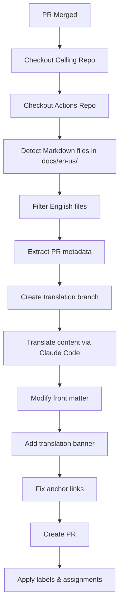

# Auto-Translate Markdown to Japanese - Design Document

This GitHub Actions workflow automatically translates newly merged English Markdown files (`.md`/`.mdx`) to Japanese, creating a pull request with the translated content in the target repository.

## Workflow trigger

The workflow triggers on:

- `workflow_call` events for reusable workflow usage across repositories
- Only processes files with extensions `.md`/`.mdx` in `docs/en-us/` directories
- Only processes files that are added or modified (not deleted)
- Requires `merged == true` condition on pull requests

## High-level flow



## Components

### 1. File detection and filtering

- **Input:** PR changed files
- **Logic:**
  - Filter for `.md` and `.mdx` files
  - Exclude files that are in `docs/ja-jp` directories
  - Only process added/modified files (not deleted)
- **Output:** List of English Markdown files to translate

### 2. PR metadata extraction

- **Input:** Original PR data
- **Extract:**
  - Original branch name
  - PR author
  - Reviewers list
  - Applied labels
  - Associated projects
  - PR title and description
- **Output:** Metadata object for replication

### 3. Translation branch creation

- **Input:** Original branch name
- **Logic:** Create branch named `<ORIGINAL_BRANCH_NAME>-ja-jp`
- **Output:** New branch reference

### 4. Content translation

- **Input:** English Markdown content
- **Process:**
  - Use Claude Code in non-interactive mode to translate content.
  - Preserve Markdown structure and formatting.
  - Maintain code blocks, links, and special syntax.
  - Generate Japanese-appropriate anchor links for headings.
- **Output:** Japanese Markdown content

### 5. File modification

- **Front-matter updates:**
  - Change `displayed_sidebar: docsEnglish` to `displayed_sidebar: docsJapanese`.
  - Preserve all other front-matter properties.
- **Translation banner:**
  - Add import statement after front matter
  - Add banner component after title
- **Anchor link fixing:**
  - Update internal anchor links to match Japanese headings
  - Preserve external links unchanged

### 6. PR creation and metadata application

- **Create PR** with translated content
- **PR body:** Include reference to the original PR that triggered the translation
- **Apply:**
  - "documentation" label
  - Original reviewers as reviewers
  - Original author as assignee
  - Same projects as original PR

## File structure

```markdown
.github/workflows/
└── auto-translate-markdown.yml     # Main workflow file

auto-translate-markdown/
├── translate-markdown.js           # Main translation logic
├── claude-code-translator.js       # Claude Code integration
├── file-processor.js              # File content manipulation
├── pr-metadata-extractor.js       # GitHub API utilities
└── anchor-link-fixer.js           # Anchor link processing

package.json                        # Dependencies
README.md                          # Usage documentation
```

## Configuration

### Environment variables

- `ANTHROPIC_API_KEY`: Anthropic API key for Claude Code authentication
- `GITHUB_TOKEN`: GitHub token with repo permissions

### Workflow inputs (configurable)

- `target_language`: Default "ja-jp" (Japanese)
- `sidebar_mapping`: Mapping for sidebar values
- `translation_banner_path`: Path to translation banner component
- `file_extensions`: Extensions to process (default: [".md", ".mdx"])

## Translation process details

### 1. Content preprocessing

- Extract front matter
- Identify code blocks and preserve them
- Mark external links for preservation
- Extract headings for anchor link mapping

### 2. Claude Code integration

- Use Claude Code in non-interactive mode with `-p` flag
- Send structured request with context about Markdown preservation
- Include instructions for Japanese translation best practices
- Request heading translations for anchor link mapping
- Preserve technical terms and code examples

### 3. Content postprocessing

- Update front matter with sidebar changes
- Insert translation banner after title
- Map old anchor links to new Japanese heading anchors
- Validate Markdown structure

## Error handling

### Translation failures
- Log translation errors
- Skip problematic files and continue with others
- Comment on original PR with failure details

### API rate limiting

- **Implement exponential backoff for Claude Code rate limiting**
- Queue multiple files for batch processing
- Respect GitHub API rate limits

### Branch conflicts

- Check if translation branch already exists
- Handle merge conflicts gracefully
- Update existing translation PRs if needed

## Security considerations

- Store API keys as GitHub Secrets
- Validate file paths to prevent directory traversal
- Sanitize content before translation
- Limit file size for translation (e.g., max 50KB per file)

## Testing strategy

### Unit tests

- File detection and filtering logic
- Front-matter manipulation
- Anchor link fixing
- PR metadata extraction

### Integration tests

- End-to-end workflow with sample repositories
- Claude API integration testing
- GitHub API interaction testing

### Test scenarios

1. Single Markdown file translation
2. Multiple files in one PR
3. Files with complex front matter
4. Files with multiple heading levels
5. Files with existing anchor links
6. Error scenarios (API failures, rate limits)

## Performance considerations

- **Parallel processing:** Translate multiple files concurrently
- **Caching:** Cache translation results for similar content
- **Batching:** Group small files for batch translation
- **Timeouts:** Set appropriate timeouts for API calls

## Monitoring and observability

- Log translation success/failure rates
- Track API usage and costs
- Monitor workflow execution times
- Alert on repeated failures

## Future enhancements

1. **Multi-language support:** Extend beyond Japanese
2. **Custom translation rules:** Per-repository translation preferences
3. **Review automation:** Auto-approve simple translations
4. **Translation memory:** Reuse previous translations for consistency
5. **Quality checks:** Automated translation quality validation

## Dependencies

### Node.js packages

- `@actions/core`: GitHub Actions utilities
- `@actions/github`: GitHub API client
- `@anthropic-ai/claude-code`: Claude Code package
- `js-yaml`: YAML front-matter processing
- `marked`: Markdown parsing
- `lodash`: Utility functions

### GitHub permissions required

- `contents: write`: For creating branches and files
- `pull-requests: write`: For creating PRs
- `issues: write`: For adding labels and assignees
- `metadata: read`: For reading repository metadata

## Success criteria

1. ✅ Workflow triggers correctly on PR merge
2. ✅ Accurately detects and filters Markdown files
3. ✅ Successfully translates content via Claude Code
4. ✅ Properly modifies front matter and adds translation banner
5. ✅ Creates PR with correct metadata (reviewers, labels, projects) and reference to original PR
6. ✅ Handles errors gracefully without breaking
7. ✅ Maintains translation quality and Markdown structure
8. ✅ Processes multiple files efficiently

## Implementation phases

### Phase 1: Core workflow

- Basic file detection and filtering
- Claude Code integration
- Simple translation without advanced features

### Phase 2: Metadata replication

- PR metadata extraction
- Reviewer/assignee assignment
- Label and project replication

### Phase 3: Advanced processing

- Front-matter manipulation
- Translation banner insertion
- Anchor link fixing

### Phase 4: Polish and testing

- Error handling improvements
- Comprehensive testing
- Documentation and examples

## Opinions

The following are my opinions and observations when using Claude to create this workflow.

### Pros

- Great for:
  - Having something to start with.
  - Formulating ideas.
  - Filling in gaps that weren't considered early in the design process, like for testing.
- Responses are detailed and easy to understand why specific changes are made.

### Cons

- Struggles with understanding how different environments (in this case, repositories) should interact with one another.
  - Because of this, a lot of time was spent troubleshooting.
  - Even though tests were included, the action didn't work when run in another repository. (Consistently ran into an invalid secret for `GITHUB_TOKEN`.)
